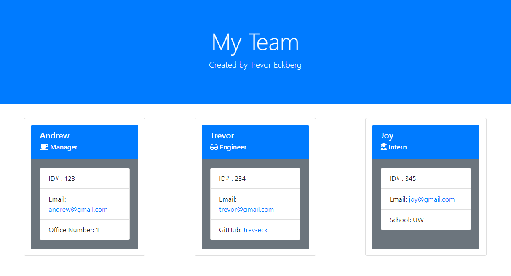

# Team Profile Generator

## Table of Contents
    
1. [Description](##description)
2. [Installation Instructions](##installation-instructions)
3. [Usage Information](##usage-information)
4. [Contribution Guidelines](##contribution-guidelines)
5. [Test Instructions](##test-instructions)
6. [Questions](##questions)
7. [License](##license)
    
    
    
## Description
The goal of this project was to generate an html file displaying team members information based on user input gathered from the command line utilizing iinquirer. The project was also required to successfully pass all tests within the jest testing suite.
    
## Installation Instructions
To ensure proper functionality of the application the user must first install all dependencies using 'npm install' . After the required packages have been installed the application can be run from the terminal using "node index.js", the default output for the html document has been set to index.html.
    
## Usage Information
The application requires input from the user to populate the html document. Minimum requirements are a Managers name, ID#, Email, and Office Number. Following the manager the user can input information about individual engineers or interns that are working on the project, including their name, email, id#, github username, and school.
    
## Contribution Guidelines
If you would like to contribute to this project please reach out to the creator, email and github are linked in the questions section.
    
## Test Instructions
The application in its current deployment passes all tests within the jest test suite, which ensure that all classes are functioning as expected.
    
## Questions
If you have further questions about the functionality of this application or need clarification regarding certain areas the creator can be contacted at: 
Email: trevor.eckberg@gmail.com  
Github: https://github.com/trev-eck/
    
## License
This application was developed under the MIT License
    
## Screenshot and Video Walkthroughs

application walk through
https://drive.google.com/file/d/1-0dt5ZMjvN2hB7Ab7BsVtLvBHYJhfJUJ/view

testing video
https://drive.google.com/file/d/1wczoa9_dMk-5ZNiRolUdmjDgvn_Gos6Q/view